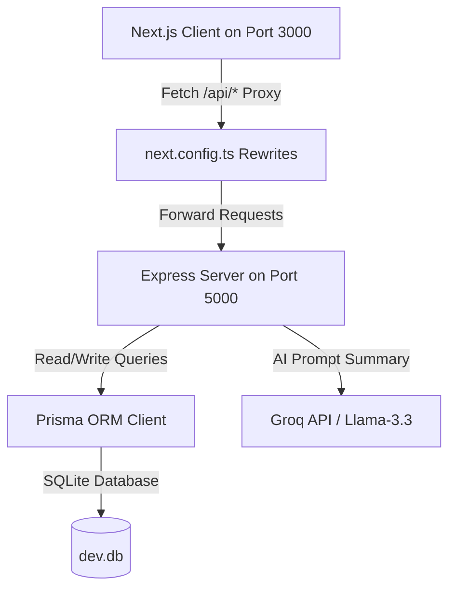

# EcoSphere — ESG Management & Gamification Platform

EcoSphere is a state-of-the-art ESG (Environmental, Social, Governance) Management Platform that turns corporate sustainability targets into engaging, gamified experiences. It features a complete scoring engine, real-time carbon emission calculations, automated policy acknowledgments, dynamic leaderboard ranks, and an AI-powered organizational health advisor.

---

## Key Highlights & Tech Stack

- **Frontend Client**: Next.js 15 (App Router), React, Recharts, Lucide React icons, persistent Local Storage theme toggling (Dark & Light Mode).
- **Backend API Server**: Express.js, TypeScript, NodeJS.
- **Database / ORM**: SQLite database managed via Prisma ORM (28 models).
- **AI Engine**: Groq SDK powered by `llama-3.3-70b-versatile` for live ESG insight generation.
- **Auth & Session**: Cookie-based JWT authentication with bcrypt password hashing.

---

## Architecture Overview

EcoSphere uses a decoupled client-server architecture:



1. **Frontend Client (`/frontend`)**: A Next.js static client that communicates with local paths (e.g. `fetch('/api/auth/me')`). The developer proxy configuration in `next.config.ts` transparently routes `/api/:path*` to `http://localhost:5000/api/:path*`.
2. **Backend API Server (`/backend`)**: A robust Express API server running on port `5000` with direct access to Prisma and the database instance.

---

## Database Schema (Prisma)

The SQLite database structure includes 28 interlinked models:

- **Core / Auth**: `User` (tracks XP, points balance, credentials), `Department` (hierarchical parent-child organization), `ESGConfig` (custom system weights).
- **Environmental**: `CarbonTransaction` (footprint logs), `EmissionFactor` (carbon lookup values), `EnvironmentalGoal` (target progress goals), `ProductESGProfile` (packaging/product metrics), `CarbonFootprintLog` (personal daily carbon calculator results).
- **Social**: `CSRActivity` (volunteer projects), `EmployeeParticipation` (joined volunteer logs), `SustainabilityPledge` (employee sustainability commitments), `PledgeEndorsement` (peer endorsements on pledges).
- **Governance**: `ESGPolicy` (rules & codes of conduct), `PolicyAcknowledgement` (employee checkmarks), `Audit` (external reviews), `ComplianceIssue` (tracked issues with owner/deadlines), `IncidentReport` (anonymous/named ESG incident reports).
- **Gamification**: `Challenge` (sustainability quests), `ChallengeParticipation` (user progression), `Badge` (unlocked milestones), `UserBadge` (awarded badge list), `Reward` (redeemable merchandise), `RewardRedemption` (user claims), `GreenCheckIn` (daily sustainability check-ins for streak tracking).
- **Analytics & Alerts**: `DepartmentScore` (historical metrics), `Notification` (system-wide alert cards), `SustainabilityTip` (rotating daily tips with helpful voting).

---

## Core Features

### 1. Unified Dashboard
- **Dynamic KPIs**: Instant widgets presenting environmental footprints, compliance rates, community participation ratios, and overall scores.
- **Visual Trends**: Emissions line charts and department ESG performance bar charts.
- **Leaderboard Rankings**: Highlights active teams and top-performing departments.
- **Groq AI ESG Insights**: Press the insight button to run Groq completion summarizing organizational health and recommending improvements.
- **Tip of the Day**: A rotating daily sustainability tip embedded in the dashboard with "Helpful" voting.

### 2. Environmental Module
- **Carbon Transactions**: Logs carbon footprint transactions (e.g. shipping, server runtime, travel) and calculates CO2e automatically.
- **Emission Factors Editor**: Configures emission multiplier ratios (e.g., kg CO2e per kWh) in real time.
- **Goals Tracker**: Progress bar gauges representing progress against custom target ceilings.
- **Carbon Footprint Calculator**: Interactive personal calculator where employees input commute mode, distance, electricity usage, and meal type to get instant daily CO2 estimates with a history chart.

### 3. Social & CSR Module
- **CSR Activities**: Interactive lists of corporate activities. Users can join volunteer opportunities and log contributions with proof submission.
- **Approval Queue**: Administrative panels to approve or reject employee volunteer logs.
- **Diversity Analytics**: Visual breakdown graphs of team distributions.
- **Sustainability Pledge Wall**: Employees make public sustainability commitments (e.g., "Go paperless for 30 days") and others can endorse/support pledges.

### 4. Governance & Policy Module
- **Compliance Issues Tracker**: Track compliance violations, assign internal owners, set deadlines, and assess overdue penalties automatically.
- **Policy Acknowledgments**: Publishes corporate guidelines with a checklist for employees to sign off.
- **Audit Registry**: Track completed audits and record compliance feedback.
- **ESG Incident Reporting**: Anonymous or named incident reporting system for environmental violations, safety hazards, or governance concerns. Admins can triage, investigate, and resolve reports.

### 5. Gamification System
- **Milestone Challenges**: Join active green challenges (e.g., "Cycle to work week") with progress increments and proof submission.
- **Badge Awarding Engine**: Automatically triggers upon XP updates, checking rules against thresholds.
- **EcoPoints Store**: Redeem points for custom merchandise (e.g. eco-bottles, solar chargers) with stock deduction guards.
- **Green Streaks**: Daily sustainability check-in system where employees log one green action per day. Consecutive days build a streak visible on the leaderboard. Streaks earn bonus XP.

### 6. Custom Reports Builder
- Standardized tabs for **Environmental**, **Social**, and **Governance** indicators.
- **Filter Suite**: Combine filters for Department, Date Range, Module, Employee, Challenge, and ESG Category to fetch custom tables.
- **Exporting**: Supports CSV downloads of custom report results.

---

## Unique Differentiating Features

These features set EcoSphere apart from typical ESG platforms:

| Feature | Description |
|---|---|
| **Carbon Footprint Calculator** | Interactive personal calculator with sliders for commute, electricity, and meal type. Instant CO2 breakdown with historical tracking. |
| **ESG Incident Reporting** | Anonymous whistleblower-style reporting with severity levels, admin triage workflow, and resolution tracking. |
| **Green Streaks & Daily Check-In** | Duolingo-style streak system for daily green actions. Builds engagement through consecutive-day tracking and a dedicated streak leaderboard. |
| **Sustainability Pledge Wall** | Social feed of employee sustainability commitments with peer endorsement. Fosters community accountability. |
| **Tip of the Day** | Rotating daily sustainability tips on the dashboard with "Helpful" voting to surface the most impactful advice. |

---

## Core Business Rules & Calculations

### 1. ESG Scoring Formulas
Department scores are updated continuously based on actions:
- **Environmental Score**: Evaluated against active goals. A score out of 100 derived from the percentage by which current emissions remain below target caps.
- **Social Score**: Evaluated against employee CSR engagement ratio (Total participants / Total employees) and average volunteer hours.
- **Governance Score**: Calculated as:
  $$\text{Score} = \text{Resolved Ratio} \times 100 - (\text{Overdue Penalty} \times 10)$$
  *(Each unresolved compliance issue that exceeds its deadline incurs a -10 penalty).*
- **Overall Score**: Weighted combination of E, S, and G scores. Weights are configurable via settings sliders.

### 2. Gamification Levels
- **XP Progression**: Employees gain XP by completing challenges, participating in CSR activities, and daily green check-ins (+5 XP per check-in).
- **Leveling Up**: Level is calculated as:
  $$\text{Level} = \left\lfloor \frac{\text{Total XP}}{100} \right\rfloor + 1$$
- **Badge triggers**: Unlocking badges awards instant XP bonuses.

### 3. Carbon Footprint Calculator Factors
- **Commute**: Car (0.21 kg CO2/km), Bus (0.089 kg CO2/km), Bike/Walk/WFH (0)
- **Electricity**: 0.5 kg CO2 per kWh
- **Meals**: Vegan (0.5 kg), Vegetarian (1.0 kg), Mixed (2.5 kg), Meat-Heavy (5.0 kg) per meal × 3 meals/day

---

## Getting Started

### Prerequisites
- Node.js (version 18 or above recommended)
- NPM or Yarn package manager

---

### 1. Backend Setup

1. Navigate to the backend directory:
   ```bash
   cd backend
   ```

2. Install dependencies:
   ```bash
   npm install
   ```

3. Configure your environment variables. Create a `.env` file in the `/backend` folder:
   ```env
   PORT=5000
   DATABASE_URL="file:./prisma/dev.db"
   JWT_SECRET="YOUR_SUPER_SECRET_JWT_KEY"
   GROQ_API_KEY="YOUR_GROQ_LLAMA_KEY"
   ```

4. Initialize the Prisma database schema and run migrations:
   ```bash
   npx prisma migrate dev --name init
   ```

5. Seed the database with initial metrics, default departments, users, and challenges:
   ```bash
   npm run seed
   ```

6. Start the development server on port `5000`:
   ```bash
   npm run dev
   ```

---

### 2. Frontend Client Setup

1. Navigate to the frontend directory:
   ```bash
   cd frontend
   ```

2. Install dependencies:
   ```bash
   npm install
   ```

3. Start the Next.js development server on port `3000`:
   ```bash
   npm run dev
   ```

4. Open your browser and navigate to `http://localhost:3000`.

---

## Seeded Demo Account Credentials
For testing purposes, sign in using these accounts (password is `password123` for all):
- **Admin**: `admin@ecosphere.com`
- **Manager (Logistics)**: `neha@ecosphere.com`
- **Manager (Manufacturing)**: `vikram@ecosphere.com`
- **Manager (Corporate)**: `amit@ecosphere.com`
- **Employee (Logistics)**: `riyer@ecosphere.com`
- **Employee (Corporate)**: `amehta@ecosphere.com`

---

## Repository Directory Structure

```text
ecoshpere_management/
├── backend/                      # Express API Server
│   ├── prisma/                   # SQLite database & Prisma Schema config
│   │   ├── migrations/           # Database migration history
│   │   ├── prisma/dev.db         # Active SQLite database instance
│   │   └── schema.prisma         # 28-model Prisma schema
│   ├── src/
│   │   ├── lib/                  # Business rules (scoring, badge awarding, JWT auth)
│   │   ├── middleware/           # Authentication guards (requireAuth, requireAdmin, requireManager)
│   │   ├── routes/               # Modular Express sub-routers
│   │   │   ├── auth.ts           # Login, register, session management
│   │   │   ├── users.ts          # User CRUD & profile management
│   │   │   ├── environmental.ts  # Carbon transactions, goals, emission factors, product profiles
│   │   │   ├── csr.ts            # CSR activities, employee participation, proof submission
│   │   │   ├── governance.ts     # Policies, acknowledgements, audits, compliance issues
│   │   │   ├── challenges.ts     # Challenges, participation, badge awarding
│   │   │   ├── analytics.ts      # Dashboard KPIs, reports, AI insights
│   │   │   ├── settings.ts       # System config, department scores, notifications
│   │   │   ├── carbon-calculator.ts  # Personal carbon footprint calculator
│   │   │   ├── incidents.ts      # ESG incident reporting (anonymous/named)
│   │   │   ├── streaks.ts        # Green streaks & daily check-in
│   │   │   ├── pledges.ts        # Sustainability pledge wall & endorsements
│   │   │   └── tips.ts           # Daily sustainability tips
│   │   ├── index.ts              # Express app bootstrap & router mounting
│   │   └── seed.ts               # Database seeding routines
│   ├── package.json
│   └── tsconfig.json
├── frontend/                     # Next.js Frontend Client
│   ├── src/
│   │   ├── app/                  # App Router pages
│   │   │   ├── dashboard/        # Main dashboard with KPIs, charts, tip of the day
│   │   │   │   ├── environmental/    # Emission factors, goals, carbon calculator
│   │   │   │   ├── social/           # CSR activities, participation, diversity, pledge wall
│   │   │   │   ├── governance/       # Policies, audits, compliance, incidents
│   │   │   │   ├── gamification/     # Challenges, badges, rewards, leaderboard, streaks
│   │   │   │   ├── reports/          # Custom report builder with CSV export
│   │   │   │   ├── settings/         # System configuration
│   │   │   │   └── profile/          # User profile
│   │   │   └── page.tsx          # Login page
│   │   └── components/           # Sidebar with Lucide icons, theme toggle
│   ├── public/                   # Static assets
│   ├── package.json
│   ├── next.config.ts
│   └── tsconfig.json
├── .gitignore
└── README.md
```

---

## Developer Command Reference
Below are shortcuts configured for rapid testing:
- `cd frontend && npm run build`: Compiles Next.js frontend, performing strict type checks.
- `cd backend && npm run build`: Compiles server-side TypeScript configurations.
- `cd backend && npx prisma studio`: Opens the visual SQLite browser to manually verify row operations.
- `cd backend && npx tsc --noEmit`: Type-check backend without emitting files.
- `cd backend && npx tsx src/seed.ts`: Re-seed the database with fresh sample data.
